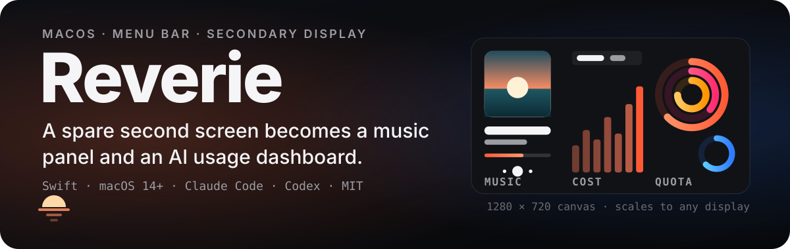
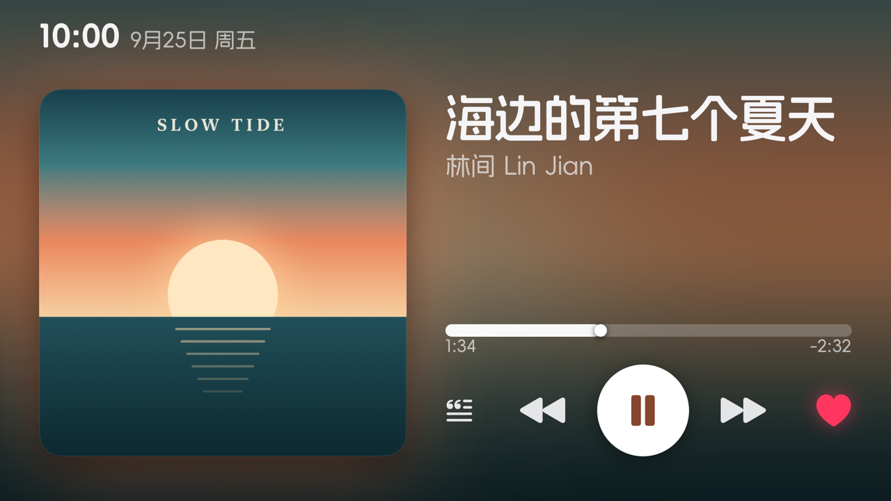
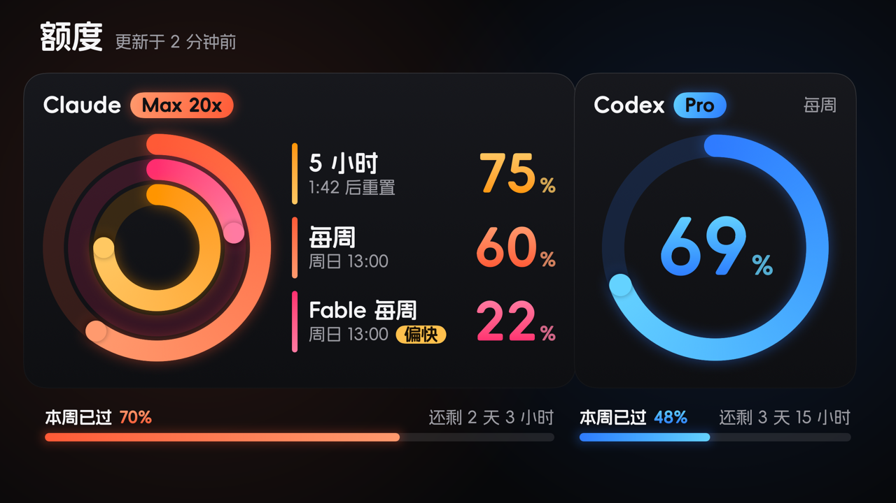
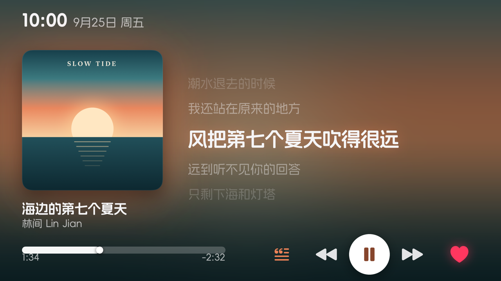
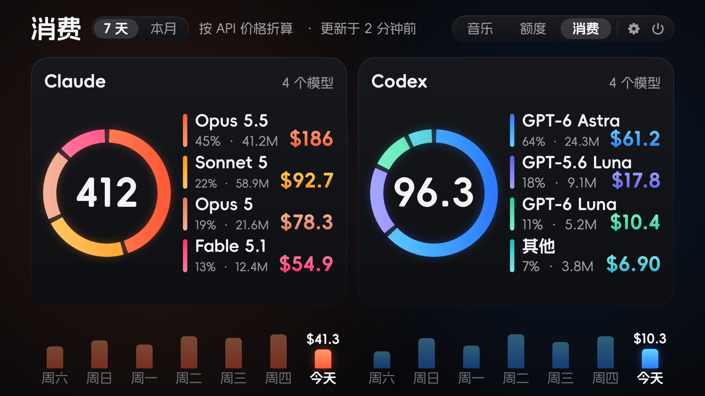
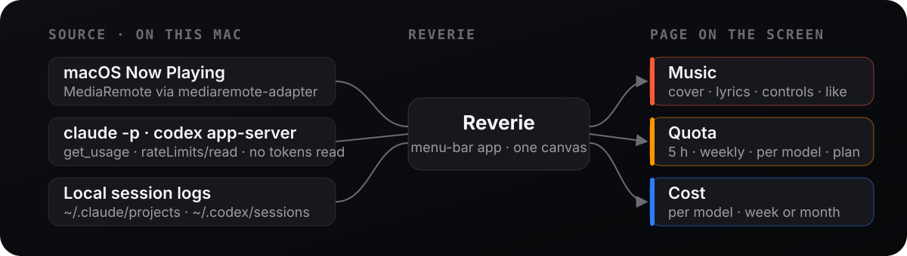

<p align="center">
  
</p>

<p align="center"><b>English</b> · <a href="./README.zh-CN.md">中文</a> · <a href="./README.ja.md">日本語</a></p>

A macOS menu-bar app that turns a small secondary display into a now-playing panel and an AI-usage dashboard.

<p align="center"> </p>
<p align="center"> </p>

**Three pages**, switched by hovering the top-right corner, a two-finger horizontal swipe, ⌃⌥⌘R, or the menu-bar icon:

- **Music** — cover art, title, lyrics (NetEase Cloud Music / Apple Music), progress, prev / play / next / like. The background is the cover art blurred and stretched, so every song recolors the page.
- **Quota** — Claude Code and Codex rate limits (5-hour, weekly, per-model such as Fable), subscription tier, cycle progress and a "burning fast" badge. Read directly from the `claude` and `codex` CLIs on this Mac; no third-party service.
- **Cost** — what your local Claude Code and Codex usage *would* cost at API prices, per model, last 7 days or this month, with a daily bar chart. (Subscribers pay a flat fee; this is a reference number, not a bill.)

Designed on a 5-inch 1280×720 panel; the 1280×720 canvas scales to any display size (letterboxed when the aspect ratio differs). Text is never smaller than 24 px and every hit target is at least 72 px, so it works from across the desk.

## How it works

<p align="center">
  
</p>

## Install

Requirements: macOS 14+, Xcode Command Line Tools, `cmake`, and — for the quota/cost pages — [Claude Code](https://claude.com/claude-code) and/or [Codex CLI](https://github.com/openai/codex) logged in.

```bash
git clone https://github.com/Rurutia-Artemis/Reverie.git
cd Reverie
bash scripts/setup.sh        # fetches and builds mediaremote-adapter (pinned commit)
bash scripts/make-cert.sh    # one-time: a self-signed "Reverie Local" code-signing certificate
bash app/build.sh            # app/Reverie.app
bash scripts/deploy.sh app/Reverie.app --enable-autostart   # installs to /Applications and starts at login
```

Why the certificate: macOS ties Accessibility / Automation grants to the signing identity. A stable self-signed identity keeps those grants across rebuilds; without it `build.sh` falls back to ad-hoc signing and you re-grant after every build.

First launch picks the smallest non-primary display and remembers it. Change it in Settings → 副屏.

## Permissions it asks for

- **Accessibility** — to move stray windows off the secondary display and to toggle NetEase "like" via its menu.
- **Automation → Music** — to read / toggle "favorited" in Apple Music.
- **Login item** — if you enable autostart.

## Privacy

Everything runs locally.

- Now-playing data comes from macOS MediaRemote via [mediaremote-adapter](https://github.com/ungive/mediaremote-adapter).
- Lyrics and hi-res covers are fetched from NetEase's public API by title + artist. That is the only network call.
- Quota is read by spawning `claude -p` (control request `get_usage`, no prompt is sent, no quota is used) and `codex app-server` (`account/rateLimits/read`). Reverie never reads or stores tokens. The Claude subscription multiplier (e.g. "20x") is read with `/usr/bin/security` from the credential item Claude Code itself stores; only the tier field is kept.
- Cost is computed from `~/.claude/projects/**/*.jsonl` and `~/.codex/sessions/**/*.jsonl` with prices from [models.dev](https://models.dev); an incremental cache lives in `~/Library/Application Support/Reverie/`.

## Development

```bash
bash app/test.sh                                              # pure-logic unit tests
REVERIE_FIXTURE=quota-design REVERIE_SNAPSHOT=/tmp/x.png app/Reverie.app/Contents/MacOS/Reverie   # deterministic render
REVERIE_SNAPSHOT=/tmp/x.png REVERIE_PAGE=cost REVERIE_SNAPSHOT_SIZE=1920x1080 app/Reverie.app/Contents/MacOS/Reverie   # live render at any size
swift scripts/check-window.swift                              # what is on the target display right now
```

`CLAUDE.md` describes the architecture and conventions in detail (in Chinese). Design tokens live in `app/Sources/UI/Theme.swift`. Bundled UI text is Chinese (it was built for a Chinese-speaking desk); the code and this README are English.

## Credits

- [mediaremote-adapter](https://github.com/ungive/mediaremote-adapter) — now-playing on macOS 15.4+
- [CodexBar](https://github.com/steipete/CodexBar) — reference for the CLI probes and pricing table
- Font: 阿里妈妈方圆体 (Alimama FangYuanTi VF) © Taobao (China) Software Co., Ltd., bundled under its free commercial license

License: MIT.
